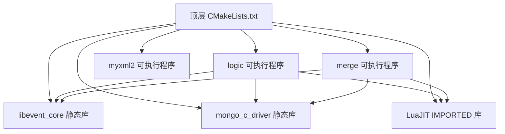

# 设计文档：CMake 构建系统迁移

## 概述

本设计将现有游戏服务器引擎的构建系统从 Makefile + Visual Studio .vcproj 迁移到 CMake。目标是用一套 CMakeLists.txt 文件统一管理 Linux（GCC）和 Windows（MSVC）两个平台的构建流程，同时保持与现有构建行为完全一致。

迁移范围包括：
- 顶层项目配置
- 三个捆绑库（libevent、mongo_c_driver、luajit）的构建/链接配置
- 三个可执行目标（logic、merge、myxml2）的编译和链接
- 跨平台编译选项、预处理宏、安装目标

设计原则：
1. 保持与现有 Makefile/vcproj 行为一致，不引入新的编译行为
2. 利用 CMake 的跨平台能力消除平台特定构建文件的维护负担
3. 使用现代 CMake（target-based）实践，通过 `target_*` 命令管理依赖

## 架构

### CMakeLists.txt 文件层次结构

```
项目根目录/
├── CMakeLists.txt              # 顶层：项目定义、全局选项、add_subdirectory
├── libevent/CMakeLists.txt     # libevent_core 静态库
├── mongo_c_driver/CMakeLists.txt  # mongo_c_driver 静态库
├── logic/CMakeLists.txt        # logic 可执行程序
├── merge/CMakeLists.txt        # merge 可执行程序
└── myxml2/CMakeLists.txt       # myxml2 可执行程序
```

### 构建依赖关系图



### 设计决策

| 决策 | 选择 | 理由 |
|------|------|------|
| CMake 最低版本 | 3.10 | 支持现代 target-based 命令，兼容大多数发行版 |
| 库构建方式 | 源码内 add_subdirectory | libevent 和 mongo_c_driver 以源码形式捆绑，无需 find_package |
| LuaJIT 集成 | IMPORTED 库目标 | Linux 链接系统库，Windows 链接预编译 .lib，IMPORTED 目标可统一处理 |
| 平台判断 | `if(WIN32)` / `if(UNIX)` | CMake 标准平台判断方式 |
| 源文件收集 | 显式列出 `file(GLOB ...)` | 使用 GLOB 匹配现有 Makefile 的 wildcard 行为 |

## 组件与接口

### 1. 顶层 CMakeLists.txt

职责：
- 设置 `cmake_minimum_required(VERSION 3.10)` 和 `project(GameServer)`
- 设置全局编译选项（通过平台判断）
- 通过 `add_subdirectory()` 引入所有子项目
- 配置 LuaJIT IMPORTED 目标（因为它不是源码构建的子项目）

```cmake
cmake_minimum_required(VERSION 3.10)
project(GameServer C CXX)

# 全局编译选项
if(UNIX)
    add_compile_options(-g -Wall -march=x86-64)
elseif(WIN32)
    add_compile_options(/W1 /Zi)
endif()

# LuaJIT IMPORTED 目标
add_library(luajit STATIC IMPORTED)
set_target_properties(luajit PROPERTIES
    INTERFACE_INCLUDE_DIRECTORIES "${CMAKE_SOURCE_DIR}/luajit"
)
if(UNIX)
    set_target_properties(luajit PROPERTIES
        IMPORTED_LOCATION "/usr/lib/x86_64-linux-gnu/libluajit-5.1.a"
    )
    # 或使用 find_library 查找
elseif(WIN32)
    set_target_properties(luajit PROPERTIES
        IMPORTED_LOCATION "${CMAKE_SOURCE_DIR}/luajit/lua51.lib"
    )
endif()

# 子项目
add_subdirectory(libevent)
add_subdirectory(mongo_c_driver)
add_subdirectory(logic)
add_subdirectory(merge)
add_subdirectory(myxml2)
```

### 2. libevent/CMakeLists.txt

职责：构建 `libevent_core` 静态库

关键逻辑：
- 公共源文件：buffer.c, bufferevent.c, bufferevent_ratelim.c, bufferevent_sock.c, event.c, evmap.c, evutil.c, evutil_rand.c, listener.c, log.c, strlcpy.c, arc4random.c
- Windows 额外源文件：win32select.c, buffer_iocp.c, event_iocp.c, bufferevent_async.c
- Linux 额外源文件：signal.c
- Windows 排除：signal.c
- Linux 排除：win32select.c, buffer_iocp.c, event_iocp.c, bufferevent_async.c

头文件搜索路径：
- 公共：`libevent/include`
- Windows 额外：`libevent/WIN32-Code`、`libevent/compat`

### 3. mongo_c_driver/CMakeLists.txt

职责：构建 `mongo_c_driver` 静态库

源文件：bson.c, encoding.c, env.c, md5.c, mongo.c, numbers.c

预处理宏：
- Linux：`NDEBUG`, `_POSIX_C_SOURCE=200112L`, `MONGO_HAVE_STDINT`
- Windows：`INT32_MAX=0x7fffffff`, `MONGO_STATIC_BUILD`, `MONGO_USE_LONG_LONG_INT`, `snprintf=_snprintf`

### 4. logic/CMakeLists.txt

职责：构建 `logic` 可执行程序

源文件：`logic/*.cpp` + `common/*.cpp`

头文件搜索路径：logic, common, luajit, mongo_c_driver, libevent/include

链接库：libevent_core, mongo_c_driver, luajit
- Linux 额外：pthread, dl, rt
- Windows 额外：ws2_32

预处理宏：
- Linux：`NDEBUG`, `_POSIX_C_SOURCE=200112L`, `MONGO_HAVE_STDINT`
- Windows：`WIN32`, `INT32_MAX=0x7fffffff`, `MONGO_STATIC_BUILD`, `MONGO_USE_LONG_LONG_INT`, `snprintf=_snprintf`

### 5. merge/CMakeLists.txt

职责：构建 `merge` 可执行程序

源文件：`merge/*.cpp` + `common/*.cpp`

头文件搜索路径：merge, common, logic, luajit, mongo_c_driver, libevent/include

链接库：libevent_core, mongo_c_driver, luajit
- Linux 额外：pthread, dl, rt
- Windows 额外：ws2_32

### 6. myxml2/CMakeLists.txt

职责：构建 `myxml2` 可执行程序

源文件：myxml2/myxml2.cpp（独立工具，无外部依赖）

## 数据模型

本项目为构建系统迁移，不涉及运行时数据模型变更。以下描述 CMake 构建配置中的关键数据结构：

### CMake 目标定义

| 目标名称 | 类型 | 源文件 | 依赖 |
|----------|------|--------|------|
| libevent_core | STATIC 库 | libevent/*.c（平台条件筛选） | 无 |
| mongo_c_driver | STATIC 库 | mongo_c_driver/*.c | 无 |
| luajit | IMPORTED STATIC 库 | 无（预编译） | 无 |
| logic | 可执行程序 | logic/*.cpp + common/*.cpp | libevent_core, mongo_c_driver, luajit |
| merge | 可执行程序 | merge/*.cpp + common/*.cpp | libevent_core, mongo_c_driver, luajit |
| myxml2 | 可执行程序 | myxml2/myxml2.cpp | 无 |

### 平台编译选项矩阵

| 配置项 | Linux (GCC) | Windows (MSVC) |
|--------|-------------|----------------|
| 编译选项 | `-g -Wall -march=x86-64` | `/W1 /Zi` |
| Release 优化 | `-O2` (CMake 默认) | `/O2` (CMake 默认) |
| 系统链接库 | pthread, dl, rt | ws2_32 |
| LuaJIT 链接 | 系统 libluajit-5.1 | luajit/lua51.lib |

### 预处理宏矩阵

| 目标 | Linux 宏 | Windows 宏 |
|------|----------|------------|
| mongo_c_driver | NDEBUG, _POSIX_C_SOURCE=200112L, MONGO_HAVE_STDINT | INT32_MAX=0x7fffffff, MONGO_STATIC_BUILD, MONGO_USE_LONG_LONG_INT, snprintf=_snprintf |
| logic | NDEBUG, _POSIX_C_SOURCE=200112L, MONGO_HAVE_STDINT | WIN32, INT32_MAX=0x7fffffff, MONGO_STATIC_BUILD, MONGO_USE_LONG_LONG_INT, snprintf=_snprintf |
| merge | （继承自 mongo_c_driver 的公共宏） | （继承自 mongo_c_driver 的公共宏 + WIN32） |


## 正确性属性

*属性是在系统所有有效执行中都应成立的特征或行为——本质上是关于系统应该做什么的形式化陈述。属性是人类可读规范与机器可验证正确性保证之间的桥梁。*

### 分析结论

经过对所有 10 个需求的 38 条验收标准逐一分析，本项目的所有验收标准均属于具体示例（example）类型，而非通用属性（property）类型。原因如下：

1. 构建系统配置本质上是关于特定、具体设置的——精确的文件名、精确的编译标志、精确的目录路径
2. 不存在"对于所有"的关系——每条标准都指定了确切的文件、标志或路径
3. 平台条件是二元的（Linux 或 Windows），不是一个输入范围
4. 没有需要序列化/反序列化的数据格式，没有需要验证的解析器，没有需要保持的不变量

因此，本设计不包含基于属性的测试（property-based testing）属性。所有验证将通过具体的集成测试和验证脚本完成。

## 错误处理

### CMake 配置阶段错误

| 错误场景 | 处理方式 |
|----------|----------|
| CMake 版本过低 | `cmake_minimum_required(VERSION 3.10)` 自动报错并终止 |
| Linux 下找不到 luajit-5.1 | 使用 `find_library()` 查找，找不到时输出明确错误信息并终止配置 |
| 编译器不支持 | CMake 自动检测 C/CXX 编译器，不可用时报错 |

### 构建阶段错误

| 错误场景 | 处理方式 |
|----------|----------|
| 源文件缺失 | CMake 在配置阶段即检测文件存在性，缺失时报错 |
| 链接错误 | 依赖通过 target_link_libraries 声明，CMake 自动处理构建顺序 |
| 平台不匹配的源文件 | 通过 `if(WIN32)`/`if(UNIX)` 条件编译，不会编译错误平台的文件 |

### LuaJIT 查找策略

Linux 平台下 LuaJIT 的查找应使用 `find_library()` 而非硬编码路径：

```cmake
if(UNIX)
    find_library(LUAJIT_LIB NAMES luajit-5.1)
    if(NOT LUAJIT_LIB)
        message(FATAL_ERROR "未找到 luajit-5.1 库，请安装: sudo apt install libluajit-5.1-dev")
    endif()
    set_target_properties(luajit PROPERTIES IMPORTED_LOCATION "${LUAJIT_LIB}")
endif()
```

## 测试策略

### 测试方法

由于本项目是构建系统迁移（不涉及运行时代码变更），测试策略以集成验证为主：

### 1. CMake 配置验证测试

验证 CMake 配置阶段能正确完成：

```bash
# 测试 out-of-source 构建配置
mkdir -p build && cd build
cmake .. -DCMAKE_BUILD_TYPE=Debug
# 验证：配置成功完成，无错误

cmake .. -DCMAKE_BUILD_TYPE=Release
# 验证：配置成功完成，无错误
```

### 2. 构建产物验证测试

验证所有目标正确构建：

```bash
cd build && cmake --build .
# 验证：以下文件存在
# - libevent_core 静态库（liblibevent_core.a 或 libevent_core.lib）
# - mongo_c_driver 静态库（libmongo_c_driver.a 或 mongo_c_driver.lib）
# - logic 可执行文件
# - merge 可执行文件
# - myxml2 可执行文件
```

### 3. 安装目标验证测试

```bash
cd build && cmake --install . --prefix /tmp/test_install
# 验证：/tmp/test_install/bin/logic 存在
# 验证：/tmp/test_install/bin/merge 存在
```

### 4. 行为等价性验证

最关键的测试——验证 CMake 构建的二进制文件与原 Makefile 构建的行为一致：

- 在 Linux 上分别用 Makefile 和 CMake 构建 logic，对比编译命令中的 include 路径、预处理宏、链接库是否一致
- 运行 logic 服务器，验证基本功能（连接、Lua 脚本加载）正常
- 运行 merge 工具，验证基本功能正常

### 5. CMakeLists.txt 内容验证

通过脚本或手动检查验证 CMakeLists.txt 文件内容符合需求：

| 检查项 | 对应需求 |
|--------|----------|
| 顶层文件包含 cmake_minimum_required(VERSION 3.10) | 1.1 |
| 顶层文件包含 add_subdirectory(logic/merge/myxml2) | 1.2 |
| libevent CMakeLists.txt 定义 libevent_core STATIC 库 | 2.1 |
| libevent 公共 include 路径包含 libevent/include | 2.2 |
| Windows 条件下 libevent 包含 WIN32-Code 和 compat | 2.3 |
| 平台条件源文件选择正确 | 2.4, 2.5 |
| mongo_c_driver 定义为 STATIC 库，包含所有 6 个 .c 文件 | 3.1 |
| mongo_c_driver 公共 include 路径正确 | 3.2 |
| 平台条件预处理宏正确 | 3.3, 3.4 |
| LuaJIT 定义为 IMPORTED 目标 | 4.1 |
| LuaJIT include 路径包含 luajit 目录 | 4.2 |
| Linux 链接 luajit-5.1，Windows 链接 lua51.lib | 4.3, 4.4 |
| logic 源文件包含 logic/*.cpp 和 common/*.cpp | 5.1 |
| logic include 路径完整 | 5.2 |
| logic 链接所有必需库 | 5.3, 5.4, 5.5 |
| logic 预处理宏正确 | 5.6, 5.7 |
| merge 配置与需求一致 | 6.1-6.5 |
| myxml2 配置正确 | 7.1 |
| 全局编译选项正确 | 8.1, 8.2 |
| install 目标配置正确 | 9.1, 9.2 |
| .gitignore 包含 build/ | 10.2 |

### 测试说明

本项目不使用属性基测试（property-based testing），因为：
- 所有验收标准都是具体的配置检查，不涉及随机输入
- 构建系统的正确性通过"能否成功构建"和"构建产物是否正确"来验证
- 单元测试和属性测试适用于运行时代码，不适用于构建配置文件
